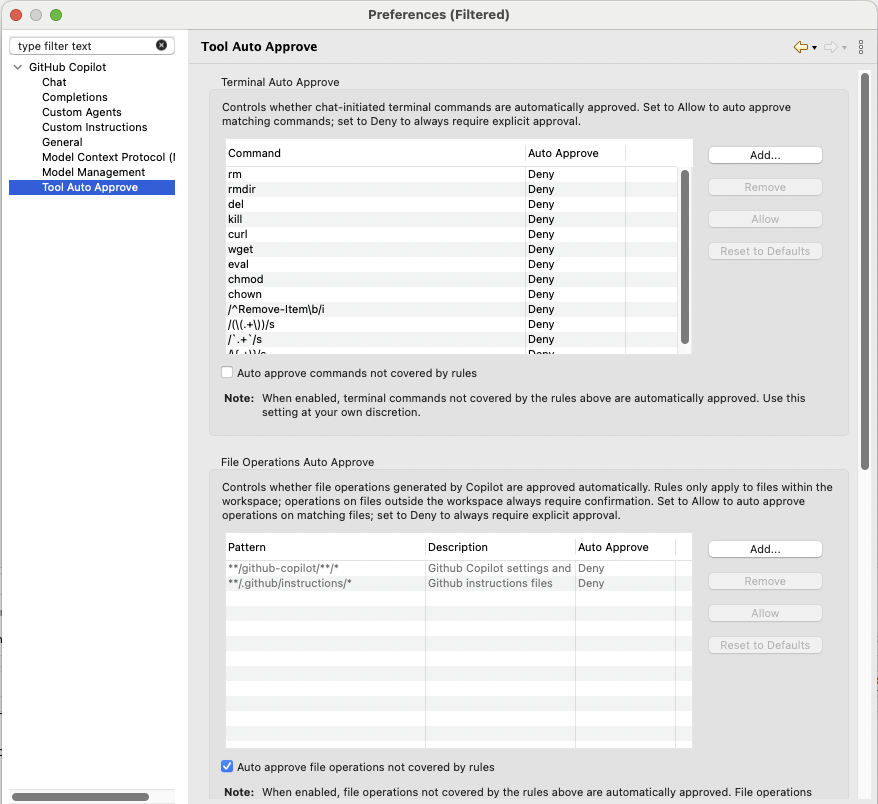

# GitHub Copilot 0.19.0 Release Notes

### Agent Tool Auto-Approve Controls
Agent Mode now supports auto-approve controls for tool confirmations. Configure rules for terminal commands, file operations, and MCP tools from Copilot preferences, or use the confirmation dialog's **Allow for Session** and **Always Allow** actions to keep trusted workflows moving without repeated prompts.

Default file safety rules, MCP tool annotations, and the global auto-approve toggle are supported, so you can reduce friction while keeping risky actions visible.

---

### Automatic Chat Context Compression
Copilot can now automatically compress chat context as conversations grow. When a session approaches the context limit, older conversation context is summarized so longer agent runs can continue with fewer interruptions.

The chat view also shows compression status while Copilot is compacting the conversation, making long-running sessions easier to follow.

---

### Create and Edit Local Files Outside the Workspace
Agent Mode can now create and edit local files by absolute path even when they are outside the Eclipse workspace. This helps when your code spans external folders, linked resources, or files that are not loaded as Eclipse projects.

Local file changes are tracked alongside workspace edits in the changed-files bar, with support for **View Diff**, **Keep**, and **Undo** flows, including empty-baseline diffs for newly created files.

---

### More Reliable Terminal Command Execution on Windows and Linux
Terminal command execution is more reliable across Windows and Linux. Copilot now runs commands through PowerShell on Windows and Bash on Linux, uses shell-integration markers to detect command completion and exit codes, and handles multiline commands with bracketed paste formatting.

Copilot also interrupts previous foreground commands before starting new ones, stops active terminal work when a chat request is canceled, truncates long terminal output before sending it back to the model, and chooses a better working directory from the current file or referenced files.

---

# GitHub Copilot 0.18.0 Release Notes

### Prepare for the Upcoming Usage-Based Billing
Starting from this version, we have added internal support for the [upcoming usage-based billing experience](https://github.blog/news-insights/company-news/github-copilot-is-moving-to-usage-based-billing/), including experience updates to the usage panel, usage notifications, and model picker. These changes will become visible once usage-based billing is rolled out.

Clients using older plugin versions will continue to function. However, the billing and usage experience may not be optimal and may not accurately reflect the latest usage-based billing experience.

---

### Custom Instructions Loading Preference
A new Copilot preference lets you control how a chat's custom instructions are loaded. Tailor when and how your project-specific or personal instructions are picked up by Copilot, giving you finer control over the context that shapes each conversation. By default, custom instructions are loaded from **all projects** in your Eclipse workspace; switch to **Referenced projects** to only load instructions from projects whose files or folders are referenced in the current chat.

---

### Skills and Prompt Files
Copilot for Eclipse now supports skills and prompt files. Define reusable prompts and skills to streamline your workflows — invoke them on demand to apply consistent instructions and patterns across your chats. Persist your skill files under `<workspace>/.github/skills/` (for example, `.github/skills/my-skill/SKILL.md`) and prompt files under `<workspace>/.github/prompts/` (e.g. `my-prompt.prompt.md`) so they're picked up automatically.

To trigger a skill or prompt in chat, type `/` in the chat input box to open the slash command picker.

---

### Thinking Blocks in Chat View
For models that support reasoning, the chat view now displays thinking blocks so you can follow Copilot's reasoning process alongside its final response. Expand or collapse the blocks to dive into the details or keep the view focused on results.

---

### Selectable Thinking Effort
You can now choose the thinking effort level for supported models. Dial the reasoning depth up for complex problems or keep it light for quick tasks — giving you control over the trade-off between latency and answer quality.

---

# GitHub Copilot 0.17.0 Release Notes

### GitHub Copilot for Eclipse Is Now Open Source
We're thrilled to share that GitHub Copilot for Eclipse is now open source! The full source code is available on GitHub at [microsoft/copilot-for-eclipse](https://github.com/microsoft/copilot-for-eclipse). Browse the code, file issues, and send pull requests — we'd love to build the plugin together with the Eclipse community. Your feedback and contributions help shape what comes next.

---

### Refreshed Chat View with a New Combo Picker
The chat view has been refreshed with a brand-new combo picker for selecting chat modes and models, with more information surfaced for each model.

---

### Session Context Window Usage at a Glance
Ever wonder how much of the conversation's context window has been consumed? The chat view now shows a context size donut indicator alongside the input area, with a popup that breaks down token usage for the current session. Auto compression is coming next.

---

### Custom Models (BYOK) for Copilot Business and Enterprise
Bring Your Own Key (BYOK) is now available to GitHub Copilot Business and Enterprise users — in addition to Individual users — when enabled by their organization. Once your organization turns it on, you can configure your own API keys for supported providers and use the custom models directly in Copilot chat in Eclipse. If you don't see custom models enabled, reach out to your organization's administrator to turn the feature on.

---

### Better ABAP Support
This release brings improved support for ABAP development in Eclipse. Copilot now provides more accurate and context-aware chat responses for ABAP projects, and it can read directories and search within the locally cached files.
